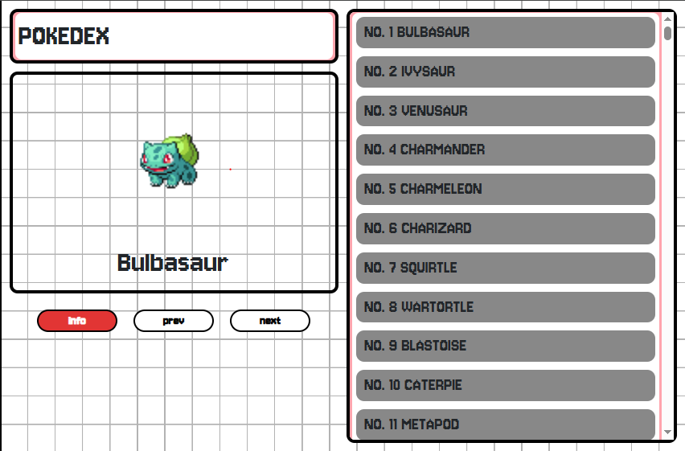
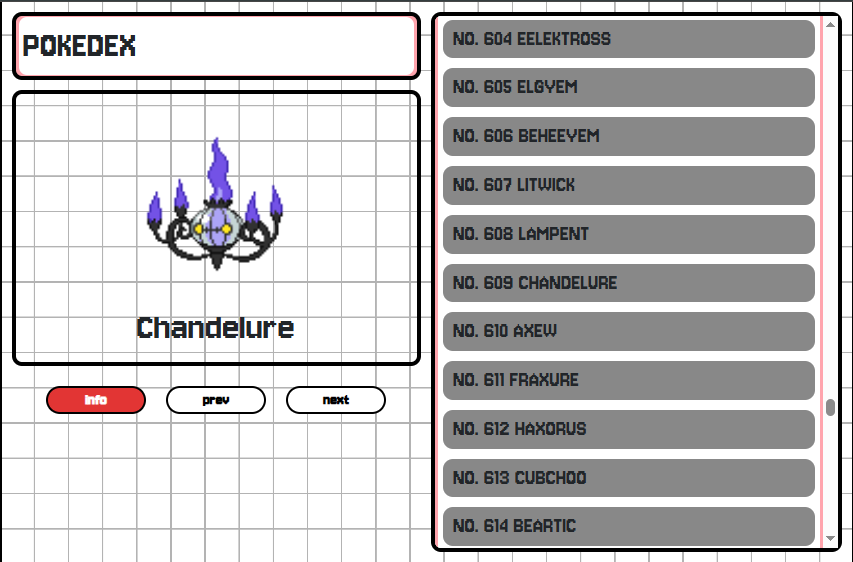
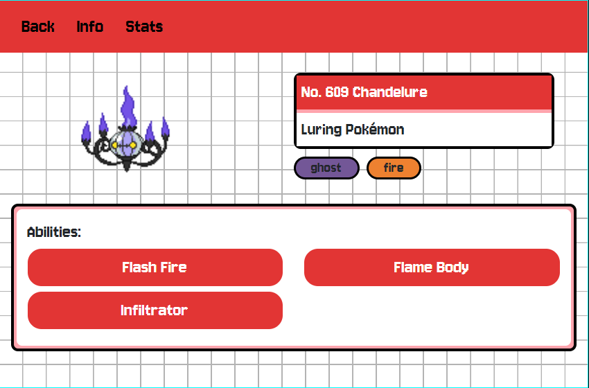
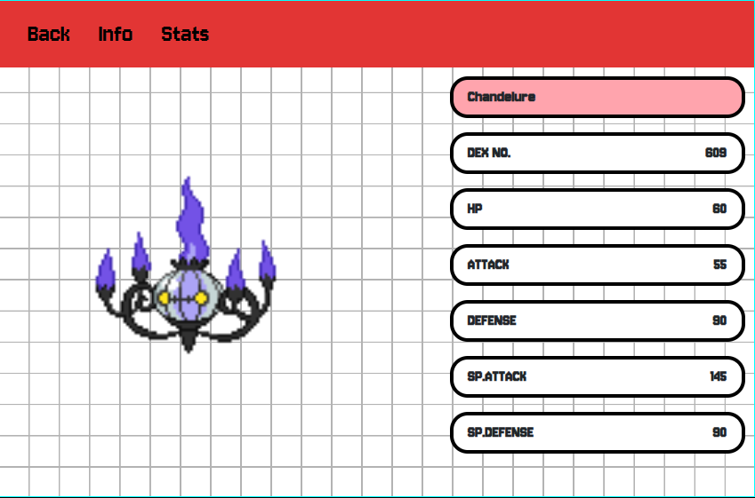
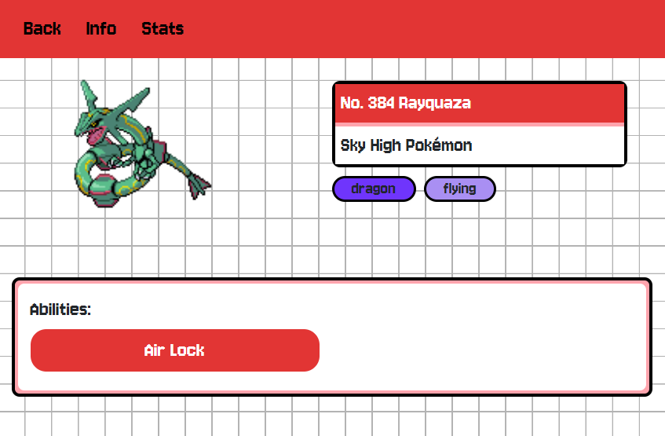
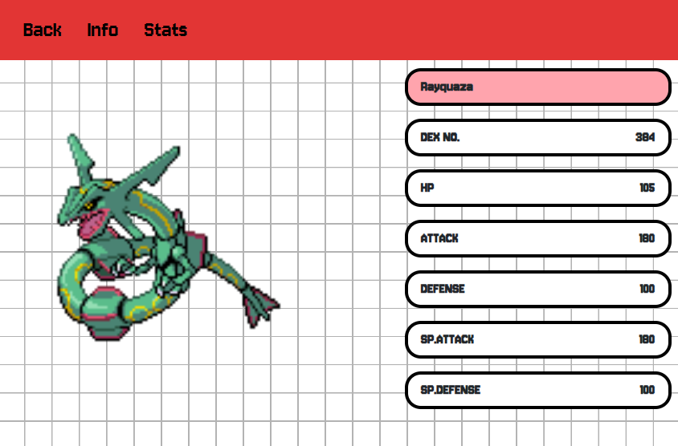

## Activity Overview:

A basic Pokedex that has the pokemon data stored via a JSON file. This mini-project just showcases the basic use of the ASP.NET framework, and blending client-side + server-side rendering practices.

___

### Pokedex List Overview:

**Default shown**: Bulbasaur.

**Other Gen Pokemons**: Chandelure

___

### Info and Stats Tab: Chandelure

**Info Tab**

**Stats Tab**

___

### Info and Stats Tab: Chandelure

**Info Tab**

**Stats Tab**

